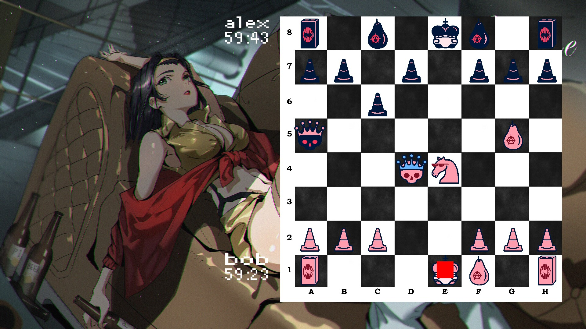
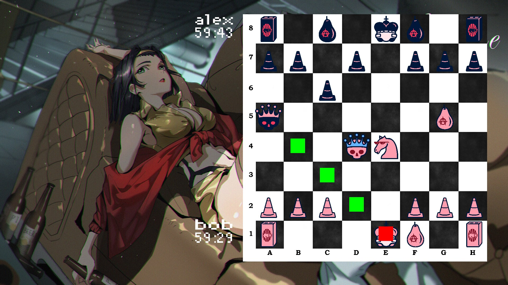
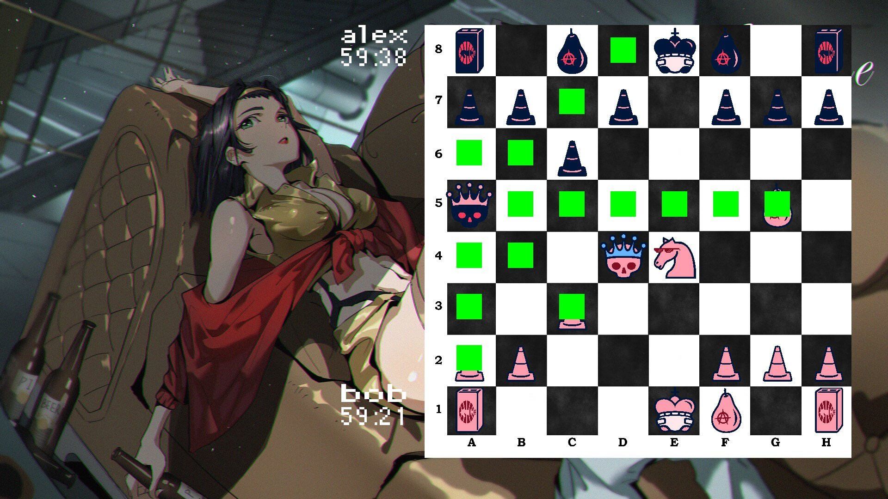

Десятая лабораторная работа.
===============================

### NOTE: нужно скачать SDL_2_VC, SDL_2_VC_Image, SDL_2_VC_TTF и распаковать папочку в Learning C++. Lab 6/SDL2.

### Вариант 2

Создайте программу, которая позволит пользователям играть в шахматы по очереди.
При этом ему выводятся сообщения об ошибке ввода, но программа не прерывается, если:
- Пользователь вводит неправильную позицию передвигаемой фигуры.
- Пользователь вводит неправильную точку движения фигуры (Передвижение не соответствующее характеру движение фигуры).
- Пользователь пытается съесть свою фигуру.
- Пользователь пытается сдвинуть фигуру блокирующую шах.

1) Реализовать игровое шахматное поле.
2) Реализовать абстрактный класс фигуры на шахматном поле и один класс конкретной фигуры.
3) Сгенерировать на поле две фигуры так, что бы они потенциально могли атаковать друг друга спустя несколько ходов.
4) Вывести поле на экран, и предоставить пользователю возможность ввести действия с фигурами от лица первого и второго игрока. После каждого хода очищать терминал и выводить поле заново.
   > формат ввода хода: `g2-g4`.  До символа `-` позиция передвигаемой фигуры, после новая позиция этой же фигуры.
   > если пользователь вводит неверные данные вывести сообщение об ошибке и заставить его ввести данные повторно.
5) Запомнить все передвижения фигур и вывести их историю действий.
6) (Усложненный вариант) Ввести механизм регистрации игроков (вводится имя) и определения цвета за который будет играть игрок случайным образом.   
7) (Усложненный вариант) Заполнить поле полноценным набором фигур (8 пешек, 2 слона, 2 коня, 2 ладьи, ферзь и король) для белых и черных. И провести игру двух игроков до победы одного из них или согласия с ничьей. Последовательность хода соответствует цвету фигур игрока. Игра ведется с ограничение по времени на ход одного игрока в 60 минут от начала игры и тратится после передачи хода от одного игрока к другому (Час на всю игру одного игрока) 
8) (Усложненный вариант) Подвести статистику по результатам: суммарное количество съетых фигур противника, суммарное количество движений фигур, время потраченное на игру, время потраченное каждым игроком, количество движений каждой фигуры, возможность просмотреть индивидуальный путь каждой фигуры, список съетых фигурой противников.

