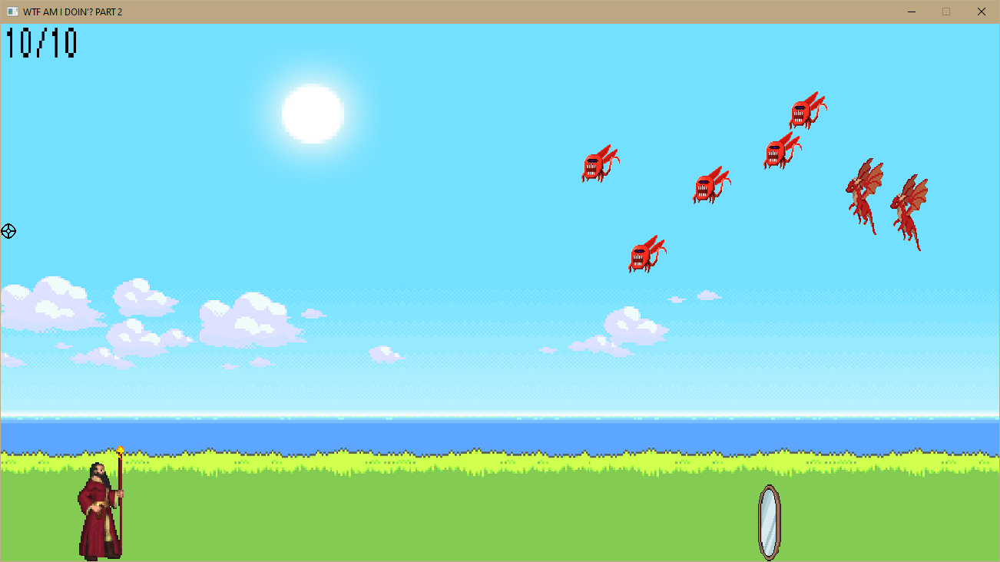

Шестая лабораторная работа.
===============================

### NOTE: нужно скачать SDL_2_VC, SDL_2_VC_Image, SDL_2_VC_TTF и распаковать папочку в Learning C++. Lab 6/SDL2

### Вариант 1

Вам необходимо реализовать класс оружия, который может стрелять по разному виду мишеней. При этом:
- У оружия есть магазин и он заполняется до максимума патронами.
- Огонь может вестись одиночными или очередями, при этом цель соответственно может получать урон либо от каждого патрона по очереди при стрельбе одиночными, либо от группы патронов при стрельбе очередью.
- Шанс попадания по цели лежит в границах от 0 до 1(double) и рассчитывается на основании параметров цели (зависит от видимости мишени и ее движения).
- При стрельбе генерируется случайное число в том же интервале значений, которое сверяется с шансом и если оно больше, то попадание засчитывается, меньше не засчитывается.
- Мишень может иметь ряд характеристик: расстояние до мишени на стрельбище, размер (площадь мишени, рассчитывается в зависимости от геометрии мишени, определяется разработчиком), форма мишени, материал (отсвечивает или нет), видимость мишени на стрельбище (зависит от расстояния, размера, материала, значит является расчетным), некоторые мишени могут быть движущимися, что влияет на шанс попадания по цели. 
- Количество мишеней на стрельбище генерируется случайным образом, при этом их варианты генерируется случайным образом и хранятся так, что работа с ними не зависит от их реального типа.
- Каждая мишень имеет параметр предельного количества попаданий, который определяет после какого количества выстрелов мишень разрушается и перестает быть доступной для стрельбы.
- Любая цель должна иметь следующие методы
  - Предоставления шанс попадания по цели
  - Получение урона, принимает в себя количество попаданий
  - Предоставление доступности для дальнейшей стрельбы

Требуется:
1. Реализовать класс стрельбища, на котором будет находится оружие и мишени.
2. Реализовать интерфейсный или абстрактный класс мишени и несколько конкретных классов мишеней. Каждый класс должен иметь свои характеристики, которые могут пересекаться с другими классами, но должна быть хотя бы 1 уникальная, которая будет влиять на расчет шанса попадания, а также разный порог попаданий.
3. (На половину баллов) Продемонстрировать работу стрельбища и мишеней.
4. (Усложненный вариант) Провести симуляцию стрельбы из оружия по мишени в течении 1 минуты. Скорострельность одиночного режима и режима стрельбы очередями генерировать для оружия перед началом симуляции, при это в процессе режим стрельбы может изменится с некоторым шансом определяемым разработчиком.
5. (Усложненный вариант) В конце вывести количество разрушенных мишеней, количество оставшихся, средний урон, нанесенный по мишеням.
